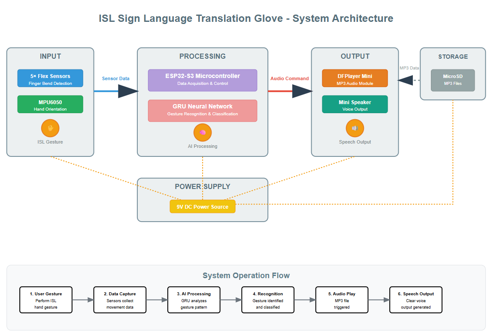

<div align="center">

# SignSpeak
### Smart Gloves for Real-Time Indian Sign Language (ISL) to Speech Translation

*A wearable AI-powered communication system for bridging the communication gap between deaf & mute individuals and the hearing community.*


</div>

---

# 📖 Overview

Communication is a fundamental part of everyday life, yet millions of people with hearing and speech impairments face significant barriers because most people are unfamiliar with **Indian Sign Language (ISL)**.

**SignSpeak** is a wearable smart glove system that translates Indian Sign Language gestures into audible speech in real time. The system combines multiple flex sensors, inertial motion sensing, embedded machine learning, and on-device inference to recognize hand gestures without requiring an external computer or smartphone.

Unlike camera-based sign language recognition systems, SignSpeak performs all gesture recognition directly on embedded hardware, making the solution lightweight, portable, cost-effective, and suitable for real-world environments such as schools, hospitals, workplaces, and public spaces.

The project demonstrates how embedded AI can be integrated with wearable technology to create assistive devices that improve accessibility and promote inclusive communication.

---

# ✨ Key Features

- 🤟 Real-time Indian Sign Language gesture recognition
- 🧠 Embedded GRU neural network running on ESP32-S3
- ⚡ Fully offline inference using TensorFlow Lite Micro
- 🖐️ Dual smart glove architecture for bimanual gesture recognition
- 📈 Multi-sensor fusion using Flex Sensors and MPU6050 IMU
- 🔊 Instant speech generation through DFPlayer Mini and Speaker
- 📡 Low-latency ESP-NOW communication between gloves
- 🔋 Portable battery-powered wearable system
- 💰 Low-cost hardware suitable for everyday usage

---

# 🎯 Problem Statement

People with hearing and speech impairments primarily communicate using sign language. Unfortunately, a large percentage of the population cannot understand sign language, making everyday interactions difficult.

Existing solutions often rely on:

- Mobile applications
- Camera-based vision systems
- Cloud processing
- Expensive wearable hardware

These approaches suffer from one or more limitations including:

- High latency
- Poor portability
- Privacy concerns
- Internet dependency
- High computational requirements

SignSpeak addresses these limitations by providing an embedded AI solution capable of recognizing ISL gestures and converting them into speech entirely on-device.

---

# 🚀 Solution

The SignSpeak system uses a combination of wearable sensors and embedded machine learning to recognize hand gestures in real time.

The workflow is simple:

1. The user performs an Indian Sign Language gesture.
2. Flex sensors capture finger bending.
3. MPU6050 captures hand orientation and motion.
4. ESP32-S3 preprocesses incoming sensor data.
5. A trained GRU model classifies the gesture.
6. The corresponding audio file is retrieved.
7. Speech is played through a mini speaker.

The complete recognition pipeline executes on the microcontroller itself, eliminating the need for external servers or continuous internet connectivity.

---

# 🏗️ System Architecture

<p align="center">
    
</p>

The SignSpeak architecture is divided into four major layers:

| Layer | Description |
|--------|-------------|
| **Input Layer** | Captures finger movement and hand orientation using Flex Sensors and MPU6050 IMU. |
| **Processing Layer** | ESP32-S3 acquires, preprocesses, and classifies gestures using a GRU neural network deployed with TensorFlow Lite Micro. |
| **Output Layer** | DFPlayer Mini retrieves the corresponding speech audio from the microSD card and plays it through a speaker. |
| **Power Layer** | Battery-powered wearable design with voltage regulation for stable operation. |

This modular architecture enables accurate real-time gesture recognition while maintaining low latency and minimal power consumption.

---

# ⚙️ How the System Works

```text
User performs ISL Gesture
            │
            ▼
Flex Sensors + MPU6050
collect sensor readings
            │
            ▼
Sensor Data Acquisition
            │
            ▼
Signal Preprocessing
Filtering + Normalization
            │
            ▼
GRU Neural Network
(TensorFlow Lite Micro)
            │
            ▼
Predicted Gesture
            │
            ▼
Retrieve Audio File
from MicroSD Card
            │
            ▼
DFPlayer Mini
            │
            ▼
Mini Speaker
Outputs Speech
```

---

# 🔧 Hardware Components

The prototype consists of two intelligent wearable gloves.

## Master Glove

The master glove is responsible for:

- Collecting local sensor data
- Receiving sensor data from the slave glove
- Data preprocessing
- Running the embedded GRU model
- Gesture prediction
- Audio playback

### Components

- ESP32-S3 Microcontroller
- 5 Flex Sensors
- MPU6050 Accelerometer & Gyroscope
- DFPlayer Mini
- MicroSD Card
- 3W Mini Speaker
- AMS1117 Voltage Regulator
- 9V Battery

---

## Slave Glove

The slave glove focuses entirely on data acquisition.

It continuously captures finger movement and hand orientation before wirelessly transmitting sensor readings to the master glove using the ESP-NOW protocol.

### Components

- ESP32 DevKit V1
- 5 Flex Sensors
- MPU6050 IMU
- AMS1117 Voltage Regulator
- 9V Battery

---

# 💻 Software & AI Stack

| Category | Technologies |
|-----------|--------------|
| Embedded Programming | C, ESP-IDF |
| Machine Learning | TensorFlow |
| Embedded Inference | TensorFlow Lite Micro |
| Neural Network | GRU (Gated Recurrent Unit) |
| Communication | ESP-NOW |
| Sensors | Flex Sensors, MPU6050 |
| Audio | DFPlayer Mini |
| Hardware Platform | ESP32-S3, ESP32 DevKit |
| Development Tools | Python, TensorFlow, ESP-IDF |

---

# 🧠 Machine Learning Pipeline

The intelligence behind SignSpeak is powered by a **Gated Recurrent Unit (GRU)** neural network designed specifically for sequential sensor data. Since sign language gestures are dynamic in nature, the model learns temporal relationships between consecutive sensor readings instead of treating every reading independently.

The complete AI pipeline consists of:

```
Sensor Data Collection
        │
        ▼
Signal Calibration
        │
        ▼
Noise Filtering
        │
        ▼
Normalization
        │
        ▼
Temporal Window Creation
        │
        ▼
GRU Model Training
        │
        ▼
TensorFlow Lite Conversion
        │
        ▼
Model Quantization (INT8)
        │
        ▼
Deployment on ESP32-S3
        │
        ▼
Real-Time Gesture Recognition
```

Unlike conventional computer vision approaches, the model works entirely with sensor readings collected from wearable gloves, allowing inference to run efficiently on embedded hardware.

---

# 📊 Dataset Preparation

To train the gesture recognition model, a custom dataset was collected from multiple participants performing commonly used Indian Sign Language gestures.

| Parameter | Value |
|-----------|--------|
| Participants | 6 |
| Supported Gestures | 12 |
| Repetitions per Gesture | 40 |
| Total Samples | 2880 |
| Sequence Duration | 2 Seconds |
| Sampling Frequency | 50 Hz |
| Time Steps per Sample | 10 |
| Features per Time Step | 22 |

Each feature vector contains:

- 10 Flex Sensor values
- 6 IMU values from the Master Glove
- 6 IMU values from the Slave Glove

Before training, the collected data undergoes:

- Sensor calibration
- Noise filtering
- Normalization
- Temporal segmentation
- Sequence generation

The processed sequences are then divided into training, validation, and testing datasets.

| Dataset | Percentage |
|-----------|------------|
| Training | 70% |
| Validation | 15% |
| Testing | 15% |

---

# 🧠 Why GRU?

Three different neural network architectures were evaluated before selecting the final model.

| Model | Observation |
|--------|-------------|
| LSTM | High accuracy but larger memory usage and slower inference |
| 1D CNN | Faster execution but weaker temporal understanding |
| **GRU** | Best balance between accuracy, speed, and memory efficiency |

GRU was ultimately selected because it provides:

- Lower computational complexity
- Reduced memory footprint
- Faster inference
- Better suitability for embedded devices
- Strong temporal learning capability

This makes it ideal for deployment on resource-constrained microcontrollers like the ESP32-S3.

---

# ⚙️ Model Architecture

The final deployed network consists of:

```
Input Sequence
      │
      ▼
GRU Layer
(48 Hidden Units)
      │
      ▼
Dropout Layer
(Rate = 0.15)
      │
      ▼
Dense Layer
(12 Neurons)
      │
      ▼
Softmax Classification
```

### Training Configuration

| Parameter | Value |
|-----------|--------|
| Framework | TensorFlow 2.12 |
| Optimizer | Adam |
| Learning Rate | 0.0008 |
| Loss Function | Sparse Categorical Crossentropy |
| Epochs | 60 |
| Batch Size | 32 |

After training, the model was converted into TensorFlow Lite format and optimized using post-training quantization for efficient embedded inference.

---

# 🚀 Embedded Deployment

One of the key highlights of SignSpeak is that the machine learning model runs directly on the microcontroller.

Deployment pipeline:

```
TensorFlow Model
        │
        ▼
TensorFlow Lite Converter
        │
        ▼
INT8 Quantization
        │
        ▼
TensorFlow Lite Micro
        │
        ▼
ESP32-S3 Firmware
        │
        ▼
Real-Time Inference
```

Model optimization significantly reduced memory usage while maintaining high recognition accuracy.

| Metric | Value |
|----------|--------|
| Original Model Size | 148 KB |
| Quantized Model Size | 41 KB |
| Tensor Arena | 60 KB |
| Average Inference Time | 92–118 ms |

---

# 📡 Wireless Communication

Since SignSpeak uses two independent gloves, communication between them is essential.

The project utilizes **ESP-NOW**, a lightweight peer-to-peer wireless communication protocol developed by Espressif.

The Slave Glove continuously transmits synchronized sensor readings to the Master Glove, where:

- Data synchronization
- Window creation
- Model inference
- Audio playback

are performed.

This architecture minimizes communication delay while maintaining synchronized gesture recognition across both hands.

---

# 📷 Prototype Demonstration

## Real-Time Testing

<p align="center">

</p>

The prototype was tested in real-time by performing Indian Sign Language gestures while continuously monitoring live sensor readings and gesture predictions.

The embedded GRU model performs inference directly on the ESP32-S3 before triggering speech playback through the DFPlayer Mini module.

---

## Final Smart Glove Prototype

<p align="center">

</p>

The completed prototype consists of:

- Master Smart Glove
- Slave Smart Glove
- Flex Sensor Network
- MPU6050 Motion Sensors
- ESP32 Controllers
- Battery Power Supply
- Embedded Wiring
- Audio Playback Module

Together, both gloves capture complete bimanual gesture information required for accurate Indian Sign Language recognition.

---

# 📈 Performance

The developed prototype demonstrated reliable real-time performance during testing.

## Gesture Recognition Accuracy

| Metric | Result |
|---------|---------|
| Training Accuracy | **95.3%** |
| Validation Accuracy | **92.1%** |
| Test Accuracy | **90.8%** |

---

## Latency

| Operation | Average Time |
|------------|--------------|
| Signal Preprocessing | 18–25 ms |
| GRU Inference | 92–118 ms |
| Audio Playback Delay | 38–45 ms |

**Total End-to-End Response Time**

**155–185 ms**

This latency enables natural conversational interaction without noticeable delay.

---

## ESP-NOW Performance

| Environment | Delay |
|-------------|--------|
| Line of Sight | 3.8 ms |
| Indoor Usage | 6.2 ms |

Packet loss remained below **1.7%**, ensuring reliable communication between the two gloves.

---

## Battery Runtime

| Device | Runtime |
|---------|----------|
| Master Glove | 3.7–4.2 Hours |
| Slave Glove | 5.4–6.1 Hours |

---

# 🚧 Challenges Faced

During development, several technical challenges were encountered:

- Collecting synchronized data from both gloves
- Reducing sensor noise and calibration inconsistencies
- Optimizing neural network size for embedded deployment
- Maintaining low-latency inference on ESP32-S3
- Designing reliable wireless communication using ESP-NOW
- Managing limited memory available on embedded hardware
- Integrating multiple hardware components into a wearable prototype

These challenges required balancing hardware limitations with machine learning performance to achieve reliable real-time operation.

---

# 🔮 Future Improvements

Potential future enhancements include:

- Support for a larger Indian Sign Language vocabulary
- Continuous sentence-level gesture recognition
- Bluetooth and Wi-Fi connectivity
- Mobile application integration
- Text-to-Speech generation instead of pre-recorded audio
- Compact custom PCB design
- Improved ergonomic wearable design
- Rechargeable battery system
- Multilingual speech output
- Cloud-assisted model updates

---

# 👨‍💻 Authors

- Ashith H Gowda
- Harshith M M
- Shreyas K
- **Sujith Kumar**

Department of Computer Science & Engineering (AI & ML)

Sahyadri College of Engineering and Management, Mangaluru, India

---

# 🙏 Acknowledgements

We sincerely thank the faculty members, mentors, and laboratory staff of the Department of Computer Science & Engineering (AI & ML), Sahyadri College of Engineering and Management, for their continuous guidance, valuable feedback, and support throughout the development of this project.

Their encouragement and access to institutional resources played an important role in the successful completion of this work.

---

<div align="center">

*SignSpeak — Bridging Communication Through Embedded AI.*

</div>
